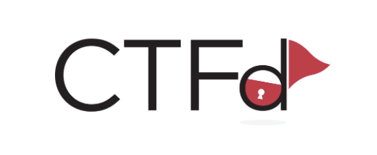

+++
title = 'Creating Custom Theme (based on core-beta)'
date = 2023-01-01T08:30:00-07:00
draft = false
tags = ['config']
+++


Creating a custom CTFd theme based on the core-beta one was not really straightforward, so while walking my way to achieving that, I’ve noted down the steps I figured out in case they might ever turn out useful for you ^.^

Plus, a [pull request](https://github.com/CTFd/core-beta/commit/ab1a24b6ddf7d081a3d27b0800a33ecb082c84cb) was submitted to the [official CTFd core-beta repository](https://github.com/CTFd/core-beta) (and accepted), and these steps are now included directly in the official documentation.


## Steps

1. Clone core-beta theme locally to a seperate folder
   ```
   git clone https://github.com/CTFd/core-beta.git custom-theme
   ```
   To clarify the structure of the project, the `./assets` folder contains the uncompiled source files (the ones you can modify), while the `./static` directory contains the compiled ones. 

2. Install [Yarn](https://classic.yarnpkg.com/en/) following the [official installation guides](https://classic.yarnpkg.com/en/docs/install).
   * **Yarn** is a dependency management tool used to install and manage project packages
   * **[Vite](https://vite.dev/guide/)** handles the frontend tooling in CTFd by building optimized assets that are served through Flask.

4. Run `yarn install` in the root of `custom-theme` folder to install the necessary Node packages including `vite`.

5. Run the appropriate yarn build mode:
   - Run `yarn dev` (this will run `vite build --watch`) while developing the theme.
   - Run `yarn build` (which will run `vite build`) for a one-time build. 
   Vite allows you to preview changes instantly with hot reloading.


6. Now, you can start your modifications in the `assets` folder. Each time you save, Vite will automatically recompile everything (assuming you are using `yarn dev`), and you can directly see the result by importing your compiled theme into a CTFd instance.
   Note: You do not need the `node_modules` folder, you can simply zip the theme directory without it.

7. When you are ready you can use `yarn build` to build the production copy of your theme.

